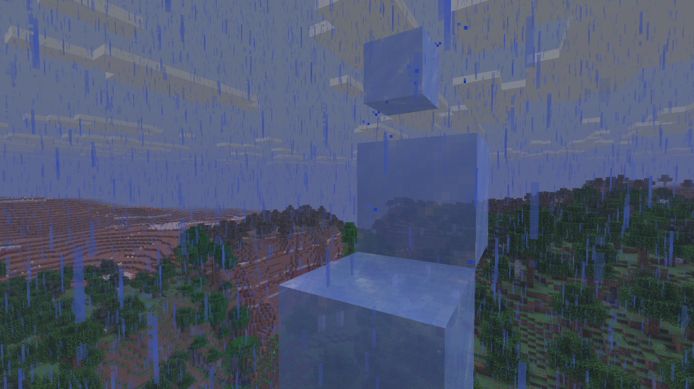

# Rain Walker

A Fabric mod that adds the **Rain Walker** boot enchantment: conjure a fleeting ice platform under your feet whenever you're caught running or falling in the rain, so you can sprint across open ground without slowing down or taking fall damage.

## Screenshots

## Features

- New treasure enchantment for boots: found in loot, not obtainable at the enchanting table
- Creates a temporary block of ice under your feet while you're in the air and moving down (falling, or the back half of a jump), exposed to open sky, and it's raining where you are
- Prevents fall damage while the ice platform is placed
- Ice disappears after roughly 1-2 seconds and leaves no water behind
- Mutually exclusive with Frost Walker and Depth Strider

## Getting One

Rain Walker is a treasure enchantment: the enchanting table will never give it to you.

With [village-quests](https://github.com/fatlard1993/village-quests) installed, a librarian who trusts you a great deal (60 reputation) can be asked what is to be done about all this rain, while it is raining and only then. They have a book for it, for 32 emeralds; the emeralds change hands only when you choose to pay.

Optional and guarded: without village-quests the mod behaves exactly as before.

## Pandorical

Rain Walker runs server-side, and Pandorical is required: the server will not load this mod without it. It syncs the enchantment's translations through Pandorical's content sync, and that is the whole of its Pandorical usage; there is no custom UI.

Clients are the optional half, and the stake is only the name. A player on a Pandorical client sees "Rain Walker"; a player on a vanilla client sees the raw translation key. The enchantment works identically either way.

## Development

Installing is in [DEVELOPMENT.md](DEVELOPMENT.md).

## License

MIT, see [LICENSE](LICENSE).
